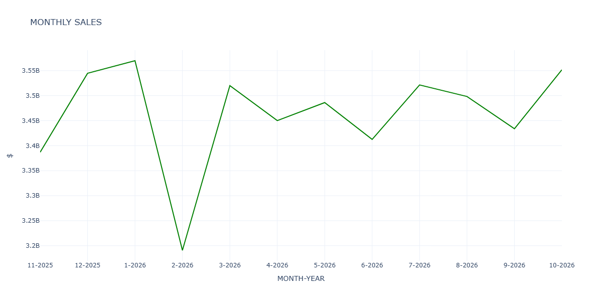
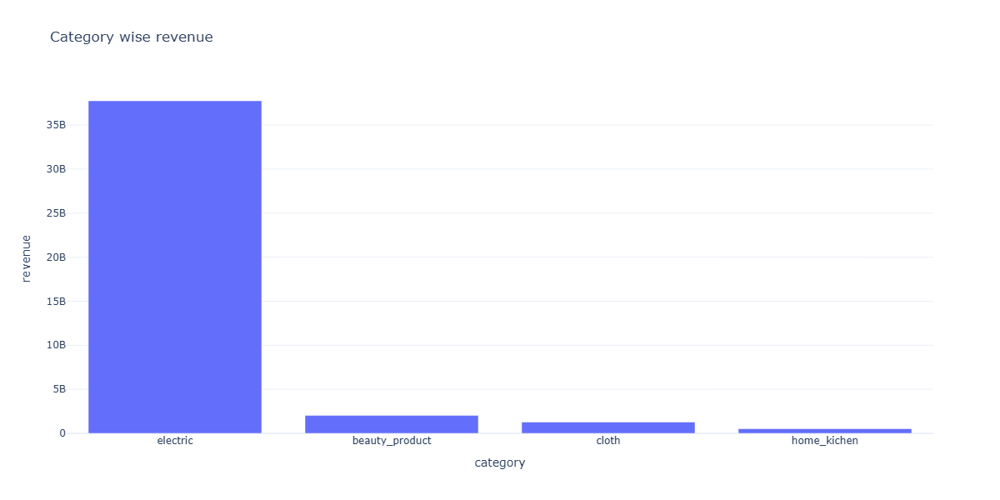
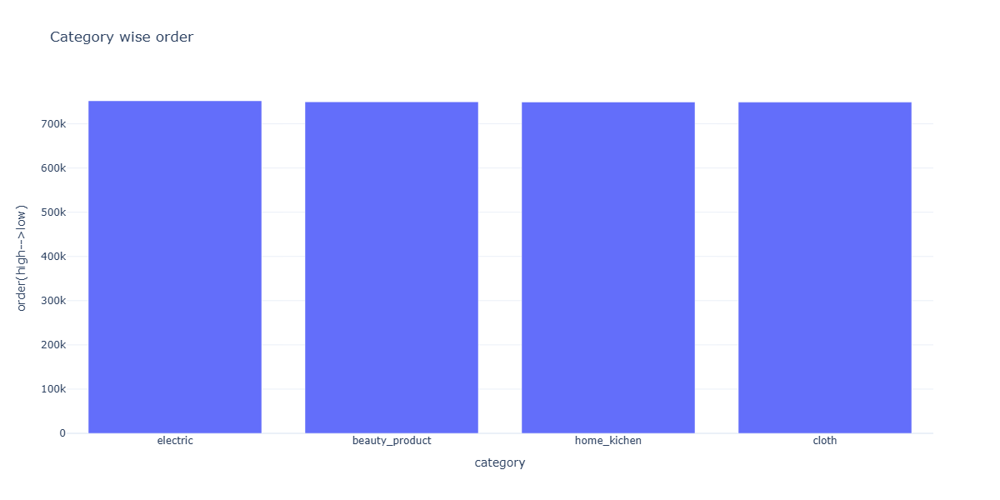
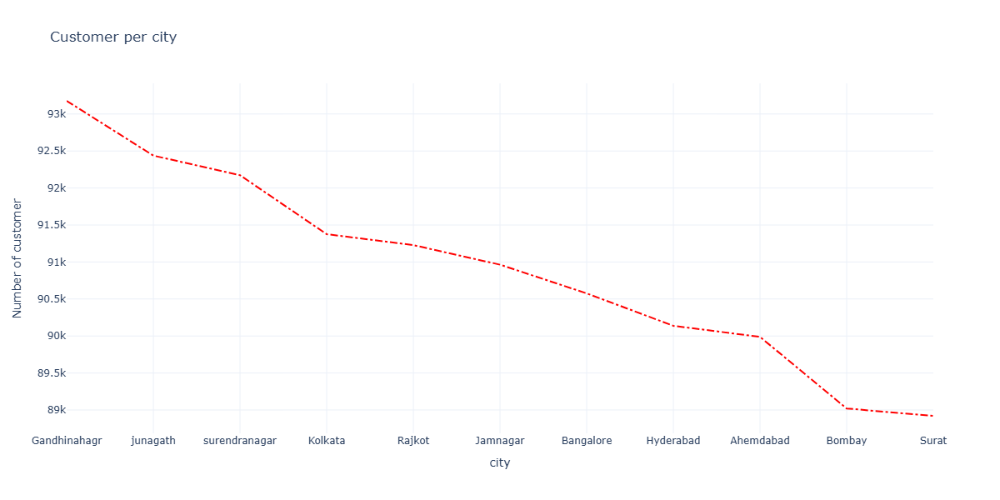

# 📊 Customer Analytics Dashboard | Python • Pandas • Plotly • Streamlit

A Python-based Customer Analytics Dashboard built using a self-generated dataset of **1,000,000 customer records**. 
--
# 📖 Project Overview

This project analyzes customer purchase data to understand business performance. It provides important KPIs, monthly revenue trends, category performance, and customer distribution through an interactive Streamlit dashboard.

---

# 🚀 Live Demo

👉 **Streamlit App:** *https://customer-analytics-dashboard-mnaww4s7u85wfxa2thwp7p.streamlit.app/*

---

# 📌 Project Overview

This project is divided into two parts:

## 1️⃣ Customer Analytics (Jupyter Notebook)

A complete data analytics project performed on a **self-generated dataset containing 1,000,000 customer records**.

The notebook includes:

- Data Generation
- Data Cleaning
- KPI Calculation
- Monthly Sales Trend Analysis
- Product Category Analysis
- Customer Distribution Analysis
- Business Insights

---

## 2️⃣ Interactive Streamlit Dashboard

The Streamlit dashboard provides an interactive interface to explore customer analytics.

For faster deployment on Streamlit Cloud, the dashboard uses a **sample dataset**, while the complete analysis is performed on the original **1 million record dataset** inside the notebooks.

---

# 📊 Dashboard Features

✅ KPI Cards

- Total Revenue
- Total Orders
- Average Order Value (AOV)

---

✅ Monthly Revenue Trend

Visualizes month-wise revenue using an interactive Plotly line chart.

---

✅ Category Performance Analysis

Shows:

- Highest Revenue Generating Category
- Highest Selling Category (Order Volume)

---

✅ Customer Distribution

Displays customer distribution across different cities.

---

# 💡 Business Insights

The project provides the following business insights:

- Identify the highest revenue generating product category.
- Identify the category with the highest sales volume.
- Track monthly revenue growth.
- Calculate Average Order Value (AOV).
- Analyze customer distribution by city.
- Understand overall sales performance.

---

# 📂 Project Structure

```
Customer-Analytics-Dashboard/

│
├── data/
│   └── sample_customer_data.csv

├── images/
│   ├── monthly_sales.png
│   ├── category_revenue.png
│   ├── category_order_sales.png
│   └── customer_city.png

├── notebooks/
│   ├── 01_Data_Generation.ipynb
│   └── 02_Customer_Analytics.ipynb

├── streamlit_app.py
├── requirements.txt
├── README.md
└── .gitignore
```

---

# 📸 Dashboard Preview

## Monthly Revenue



---

## Category Revenue



---

## Category Orders



---

## Customer Distribution



---

# 🛠️ Technologies Used

- Python
- Pandas
- NumPy
- Plotly
- Streamlit
- Jupyter Notebook
- GitHub

---

# 📈 Dataset

### Original Dataset

- Self Generated using Python
- 1,000,000 Customer Records

### Streamlit Dataset

A sample dataset is included for deployment to ensure faster loading on Streamlit Cloud.

---

# ▶️ How to Run

## Clone Repository

```bash
git clone https://github.com/prinsipansuriya16-ai/Customer-Analytics-Dashboard.git
```

---

## Install Required Libraries

```bash
pip install -r requirements.txt
```

---

## Generate Dataset

Run:

```
notebooks/01_Data_Generation.ipynb
```

This notebook generates the complete customer dataset.

---

## Run Customer Analytics Notebook

Run:

```
notebooks/02_Customer_Analytics.ipynb
```

---

## Launch Streamlit Dashboard

```bash
streamlit run streamlit_app.py
```

---

# 🎯 Future Improvements

- SQL Database Integration
- Power BI Dashboard
- Customer Segmentation
- RFM Analysis
- Predictive Sales Forecasting

---

## 👩‍💻 Author

**Priyanshi Pansuriya**
- Skills
Python
Excel
SQL
Streamlit
Plotly
Power BI (Learning)
